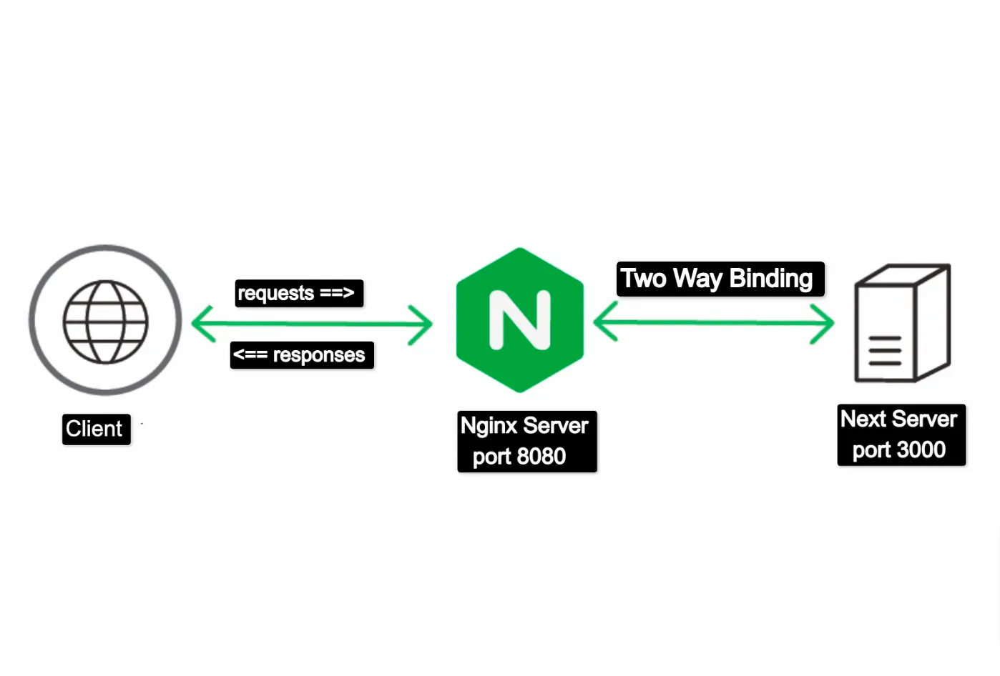

# Reverse Proxy

Adding a nginx server in front of the NextJs app

## References

- [Deploying Next.js applications using the Nginx server keeping the Next Server intact(1/2)](https://medium.com/@csrinu236/deploying-next-js-applications-using-the-nginx-server-1-2-72f8c44ed9aa)
- [Set up Docker and NGINX for a Next.js app](https://steveholgado.com/nginx-for-nextjs/)
- [How to Set Up letsencrypt with Nginx on Docker](https://phoenixnap.com/kb/letsencrypt-docker)
- [Deploy Next.Js 13 With Nginx On Ubuntu Server: HTTP/2, Gzip, Static Cache Guide](https://kaliex.co/deploy-nextjs-13-nginx-ubuntu-http2-gzip-static-cache/)
- [User guide for deploying the Next.js app in production using PM2 and Nginx?](https://episyche.com/blog/user-guide-for-deploying-the-nextjs-app-in-production-using-pm2-and-nginx)
- [Deploy Your Next.js App Like a Pro: A Step-by-Step Guide using Nginx, PM2, Certbot, and Git on your Linux Server](https://dev.to/j3rry320/deploy-your-nextjs-app-like-a-pro-a-step-by-step-guide-using-nginx-pm2-certbot-and-git-on-your-linux-server-3286)
-
